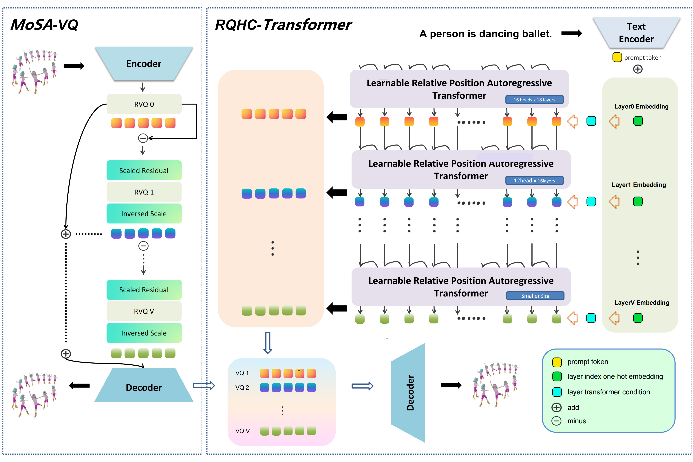
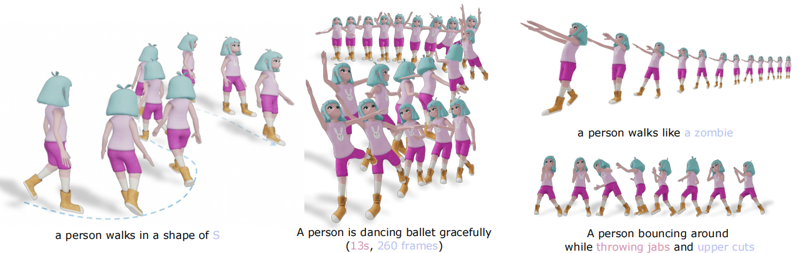
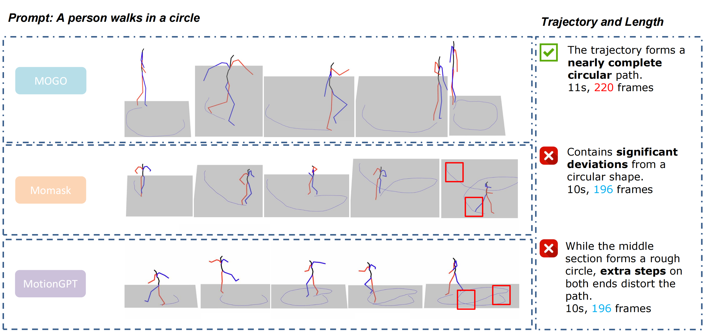
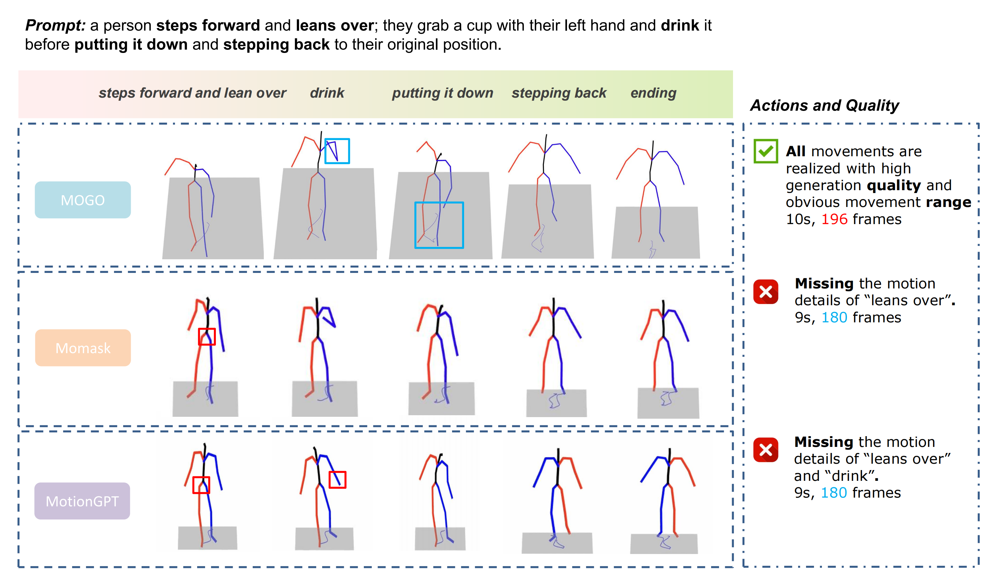
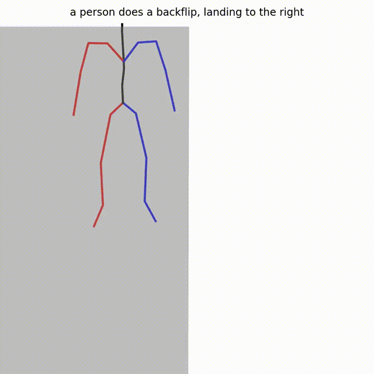
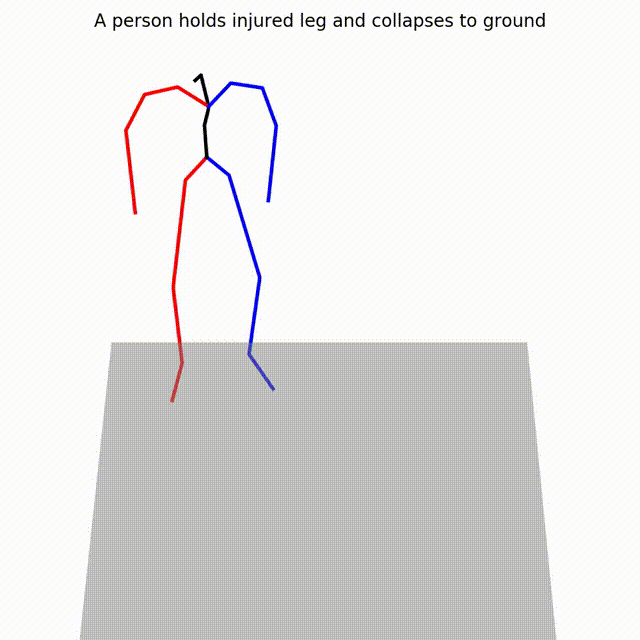
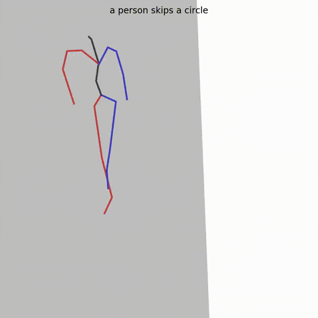
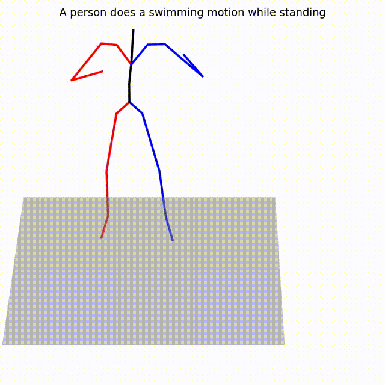

<<<<<<< HEAD
<h2 align="center">Mogo (Motion Generation with One-pass)</h2>
=======
<p align="center">
  
</p>
<h2 align="center">MOGO: Residual Quantized Hierarchical Causal
Transformer for High-Quality and Real-Time 3D
Human Motion Generation</h2>
>>>>>>> pengcheng
<p align="center">
    <a href="https://creativecommons.org/licenses/by-nc/4.0/" target="_blank" rel="noopener noreferrer">
        
    </a>
    <a href="https://github.com/MiRECoFu/Mogo/issues" target="_blank">
        
    </a>
    <a href="https://github.com/MiRECoFu/Mogo/pulls" target="_blank">
        
    </a>
    <a href="https://github.com/MiRECoFu/Mogo/stargazers" target="_blank">
        
    </a>
    <a href="https://arxiv.org/pdf/2412.07797" target="_blank">
        
    </a>
    <a href="mailto:p.fang@soton.ac.uk">
        
    </a>
</p>
<<<<<<< HEAD

This is the official implementation of papers 
- NeurIPS 2025 under review
=======
<p align="center">
<strong>MOGO: Residual Quantized Hierarchical Causal
Transformer for High-Quality and Real-Time 3D
Human Motion Generation</strong>
    <br>
    <a href='' target='_blank'>Dongjie Fu*</a>&emsp;
    <a href='' target='_blank'>Tengjiao Sun*</a>&emsp;
    <a href='' target='_blank'>Pengcheng Fang*</a>&emsp;
    <a href='' target='_blank'>Xiaohao Cai</a>&emsp;
    <a href='' target='_blank'>Hansung Kim</a>&emsp;
    <br>
    University of Southampton&emsp;
    MOGO
    <br>
</br>

<p align="center">
  
</p>
>>>>>>> pengcheng

---
## 🚀 Updates
- \[2024.06.03\] Reorganize github
- \[2024.05.21\] Submit data process and evaluation algorithms
- \[2024.11.23\] Fix some bugs.
- \[2024.08.04\] Release model architecture.

## 🔥🔥🔥 Todo
<<<<<<< HEAD
- [x] Project Page
- [x] Code
- [x] App.py
- [x] Inference code of MoSA-VQ and Mogo
=======
- [x] Code
- [x] App.py
- [x] Inference code of MoSA-VQ and Mogo
- [ ] Project Page
>>>>>>> pengcheng
- [ ] Release pretrained weights train on HumanML3D
- [ ] Release pretrained weights train on our own made huge motion dataset
- [ ] Code of infinite length continuation and generation
- [ ] Controllable motion generation

## Installation

### Conda environment setup
```
conda create -n mogo python=3.10 -y
conda activate mogo
pip install -r requirement.txt
```

<<<<<<< HEAD
## Single Image Generation
By using the following command, you can quickly generate an image with **MIGC**.
```
CUDA_VISIBLE_DEVICES=0 python inference_single_image.py
```
The following is an example of the generated image based on stable diffusion v1.4.
 
<p align="center">
  
  
</p>

By using the following command, you can quickly generate an image with **MIGC++**, where both the box and mask are used to control the instance location.
=======
## Single Motion Sequence Generation
By using the following command, you can quickly generate an image with **MOGO**.

MOGO Generation
```
CUDA_VISIBLE_DEVICES=0 python gen_t2m.py
```

MoSA-VQ Generation
```
CUDA_VISIBLE_DEVICES=0 python gen_t2m.py
>>>>>>> pengcheng
```
CUDA_VISIBLE_DEVICES=0 python migc_plus_inference_single_image.py
```
The following are examples of the generated images using MIGC++.

<<<<<<< HEAD
<p align="center">
  
</p>

## MIGC-GUI
We have combined MIGC and [GLIGEN-GUI](https://github.com/mut-ex/gligen-gui) to make art creation more convenient for users. 🔔This GUI is still being optimized. If you have any questions or suggestions, please contact me at zdw1999@zju.edu.cn.


## 🏫About us
Thank you for your interest in this project. We are a startup company, if you are interested in our project, please contact us.

## 🦄 Performance

### 🏕️ Complex Scenarios
<div align="center">
  
</div>

### 🌋 Difficult Conditions
<div align="center">
  
</div>

## Citation
If you use `Mogo` or `MoSA-VQ` in your work, please use the following BibTeX entries:
=======

## MOGO-GUI
We provide a simple GUI for MOGO. You can easily run it by casting

```
python app.py
```

## 🏫About us
Thank you for your interest in this project. We are a startup team, if you are interested in our project, please contact us.

## 🦄 Performance

### 🏕️ Instruction Completion
<p align="center">
  
</p>

### 🌋 Complex Scenarios
<p align="center">
  
</p>


## The following are examples of the generated BVH using MOGO.

<p align="center">
  
  
  
  
</p>

## Citation
If you use `MOGO` or `MoSA-VQ` in your work, please use the following BibTeX entries:
>>>>>>> pengcheng
```
@article{fu2024mogo,
  title={Mogo: RQ Hierarchical Causal Transformer for High-Quality 3D Human Motion Generation},
  author={Fu, Dongjie},
  journal={arXiv preprint arXiv:2412.07797},
  year={2024}
}
```